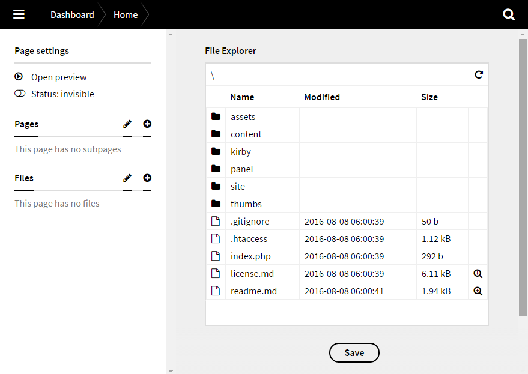
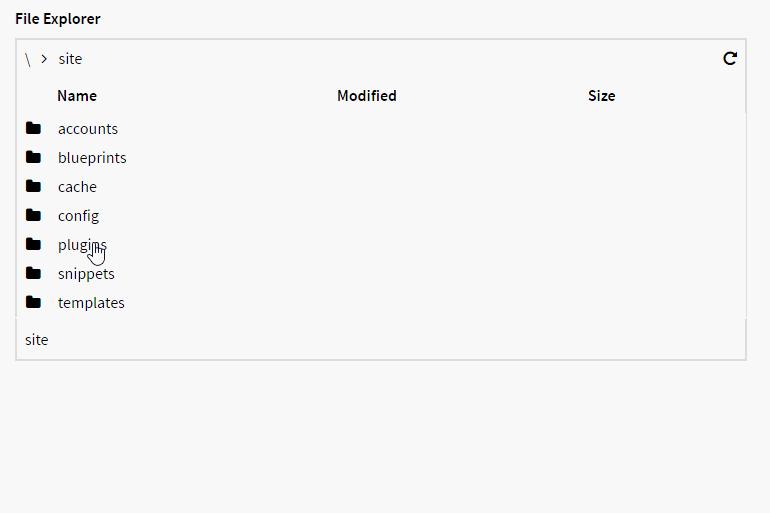
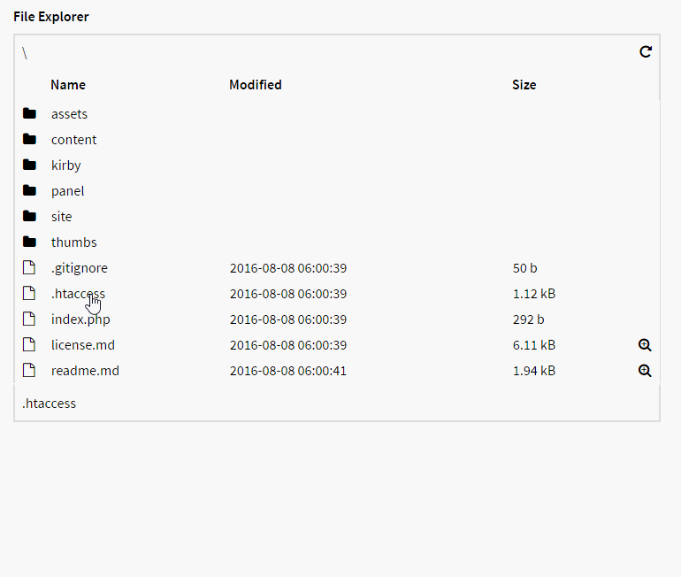
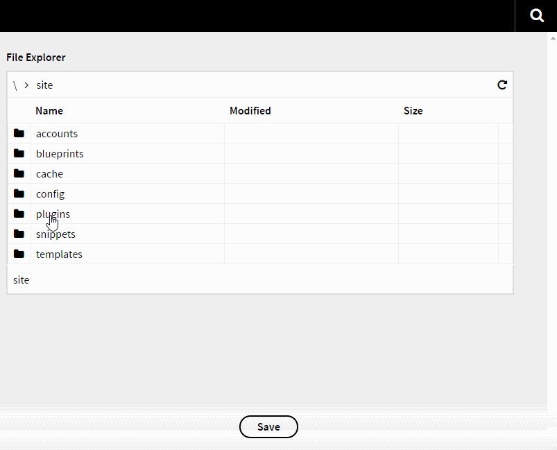

# Kirby File Explorer

- Explore files in your installation.
- View image and text files.
- Save a dir or file path.

**BE AWARE!! If you don't trust your logged in users, you should not install this field on a live server.**



## Videos

**Navigation**



**View files**



**Save value**



## Install

### Kirby CLI

Run this command:

`kirby plugin:install jenstornell/kirby-file-explorer`

### Manually

Add the folder `kirby-file-explorer` into `/site/plugins/`.

## Blueprint

```
fields:
  my_explorer:
    label: File Explorer
    type: explorer
    default: site\templates
```

### `type`

It needs to be `explorer` in order to work.

### `default` (optional)

The `default` path without the root. It will be added as value below the explorer.

## Explorer

There are two ways to navigate.

### Breadcrumb

It's often needed when you want to go back to a previous path location.

### Files and folders

Browse files and folders.

### View

By clicking on the magnifying glass icon you can view images and text files.

### Refresh

You don't need to resave to reload the files and folders, just click on the refresh arrow up to the right.

### Value

Every click you do on a file or a folder changes the value. The value is stored without the root. It's shorter and probably a little bit more safe.

## Options

Add them to `config.php`.

### Root

The default root is where kirby is installed.

```
c::set('plugin.explorer.root', kirby()->roots()->index() );
```

## Changelog

**0.1**

- Initial release

## Requirements

Kirby 2.3

## License

MIT